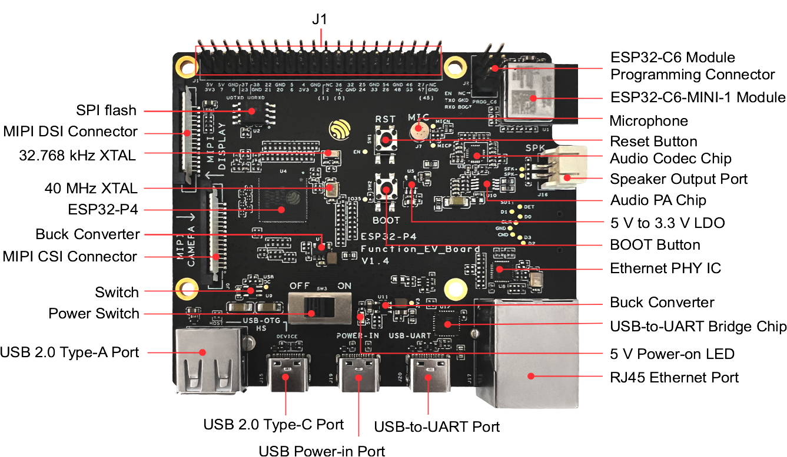

# ESP32P4
ESP32-P4 is a system on a chip that integrates the following features:
* High-performance MCU with RISC-V 32-bit dual-core and single-core microprocessors
* Powerful image and voice processing capability
* 16 MB or 32 MB PSRAM in the chip’s package
* 55 GPIOs, rich set of peripherals

Powered by 40 nm technology, ESP32-P4 provides a robust, highly-integrated platform, which helps meet the continuous demands for efficient power usage, compact design, security, high performance, and reliability.

NOTE: ESP32P4 doesn't have WiFi and Bluetooth inside it, but is used with ESP32C6 controller which will handle the IOT Connectivity related stuff, while purchasing this board, I wasn't aware of this fact while buying this board. Another important point is while buying the board Hardware Revision v1.5.2 was available, but from the website ordered I got Hardware Revision v1.4. I checked there are some improvements hardware wise but no major change which will block me.

This is how the board looks like.

## Block Diagram

