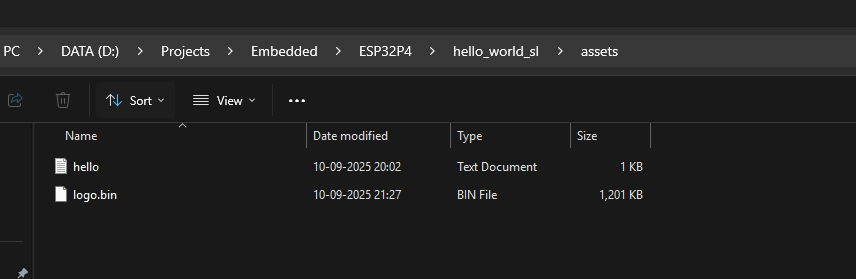

Weather Monitor
====================

The following is the website which we are using to add several components to our project.  
[Espressif Component Registry Website](https://components.espressif.com/)

The following are the components/dependencies we have added to our base project from Component Registry website.
* `esp32_p4_function_ev_board` : This component consist of board support package for this development board.
* `esp_lcd_ek79007` : This development board has the LCD `EK79007`, and this component contains the display drivers for the same.
* `esp_lcd_ili9881c` : This component contains the display drivers for the `ILI9881C` as of now I am not sure why this is added in the example project, if not required this will be removed.
* `esp_lcd_touch` : This component contains the generic touch handling.
* `esp_lcd_touch_gt911` : This contains the touch drivers for GT911
* `esp_lvgl_port` : This component contains the ESP LVGL port
* `lvgl` : This component contains the LVGL graphics library.
* `joltwallet/littlefs` : This components contains the Little Fat File System Library. Which can be used to store assets and other stuff.

### SDK Config Defaults
By default the ESP-IDF uses the `sdkconfig` during the build, and `sdkconfig.defaults` is only used when generating `sdkconfig` for the first time or when it is missing. Usualluy we write only the changes or preset values we want to apply.

This project has following changes in comparison to the `sdkconfig` file generated automatically.
```
CONFIG_IDF_TARGET="esp32p4"
CONFIG_ESPTOOLPY_FLASHMODE_QIO=y
CONFIG_ESPTOOLPY_FLASHSIZE_16MB=y
CONFIG_PARTITION_TABLE_CUSTOM=y
CONFIG_SPIRAM=y
CONFIG_SPIRAM_SPEED_200M=y
CONFIG_SPIRAM_XIP_FROM_PSRAM=y
CONFIG_LV_USE_SYSMON=y
CONFIG_LV_USE_PERF_MONITOR=y
CONFIG_LV_PERF_MONITOR_ALIGN_BOTTOM_RIGHT=y
CONFIG_LV_FONT_MONTSERRAT_48=y
# CONFIG_LV_BUILD_EXAMPLES is not set
# CONFIG_LV_BUILD_DEMOS is not set
CONFIG_IDF_EXPERIMENTAL_FEATURES=y
```

The below is the explaination of each configuration setting: 
* `CONFIG_IDF_TARGET="esp32p4"` : Setting the target.

* `CONFIG_ESPTOOLPY_FLASHMODE_QIO=y` : This sets the SPI flash mode to QIO (Quad I/O).  
    - QIO stands for Quad Input/Output, meaning the ESP32 uses 4 data lines to communicate with the flash chip.  
    - This is faster than DIO (Dual I/O) or Standard SPI, which use fewer lines.  
    - Most ESP32 boards support QIO and use it by default for better performance.  
    - It affects how the bootloader and firmware are flashed and accessed during runtime.  
    🧠 Why it matters: Faster flash access = faster boot and execution, especially for code stored in flash.

* `CONFIG_ESPTOOLPY_FLASHSIZE_16MB=y` : This tells the build system and flasher tool that your ESP32 board has 16MB of SPI flash.  
      - ESP32 modules come with various flash sizes: 2MB, 4MB, 8MB, 16MB, etc.  
      - Setting this correctly ensures your firmware is mapped properly and avoids memory access errors.  
      - It also allows you to use larger partitions (e.g., for OTA updates, file systems, or graphics assets).  
      🧠 Why it matters: If you set this incorrectly, your firmware might crash or fail to boot due to invalid memory access.  

* `CONFIG_SPIRAM=y` : This enables external SPI-connected RAM support.  
    - ESP32 chips often come with onboard PSRAM, which expands available memory beyond internal SRAM.  
    - Once enabled, ESP-IDF can allocate heap memory from PSRAM, which is great for large buffers, graphics, or networking stacks.  

* `CONFIG_SPIRAM_SPEED_200M=y` : This sets the PSRAM clock speed to 200 MHz.  
    - Higher speed means faster access to external memory.  
    - Make sure your hardware supports this speed—some PSRAM chips may only be rated for 80 MHz or 133 MHz.  
    - Overclocking PSRAM can cause instability if not properly validated.  

* `CONFIG_SPIRAM_XIP_FROM_PSRAM=y` : This enables XIP (Execute In Place) from PSRAM.  
    - Normally, code is executed from flash or internal RAM.  
    - With XIP, certain code sections (like large libraries or assets) can be executed directly from PSRAM.  
    - This is useful when internal RAM is limited and you want to run large applications without copying code into RAM.  

* `CONFIG_LV_OS_FREERTOS=y` : This tells LVGL to use FreeRTOS as its operating system backend. It enables LVGL to use FreeRTOS primitives like tasks, semaphores, and mutexes for internal operations. **This setting is removed because due to some reason the CPU consumption was 100%, will evaluate this later.**
* `CONFIG_LV_USE_FREERTOS_TASK_NOTIFY=y` : This enables LVGL to use FreeRTOS task notifications for signaling between tasks (e.g., waking up the GUI task when there's input or rendering to do). It's a lightweight and efficient mechanism compared to semaphores or queues. **This setting is removed because due to some reason the CPU consumption was 100%, will evaluate this later.**

* `CONFIG_LV_USE_SYSMON=y`, `CONFIG_LV_USE_PERF_MONITOR=y` and `CONFIG_LV_PERF_MONITOR_ALIGN_BOTTOM_RIGHT=y` are configured together to show some stats related to LVGL on the screen along with the main application.  

* `CONFIG_IDF_EXPERIMENTAL_FEATURES=y` : This enables the experimental features or some features which shall not be enabled accidently, for example `CONFIG_SPIRAM_SPEED_200M=y` this is available only when experimental features are enabled.

* `# CONFIG_LV_BUILD_EXAMPLES is not set` and `# CONFIG_LV_BUILD_DEMOS is not set` : by disabling this setting we are configuring LVGL to not compile examples and demos to save some time.


### Partition Table

The following is the example partition table (as of now used for this project).

| Name     | Type   | SubType   | Offset    | Size     | Flags  | Description                                                                       |
| -------- | ------ | --------- | --------- | -------- | ------ | --------------------------------------------------------------------------------- |
| nvs      | data   | nvs       | 0x9000    | 0x6000   |        | Non-Volatile Storage used by ESP-IDF to store key-value pairs.                    |
| phy_init | data   | phy       | 0xf000    | 0x1000   |        | PHY Initialization Data-Stores RF calibration & PHY Settings for WiFi & Bluetooth |
| factory  | app    | factory   | 0x10000   | 4M       |        | Main Application                                                                  |
| config   | data   | 0x40      | 0x410000  | 1M       |        | Custom Configuration                                                              |
| assets   | data   | littlefs  | 0x510000  | 10M      |        | Assets                                                                            |

Here the `config` section contains the custom configuration files which will be generated externally using some external tool. One such Python Script to generate such file is as shown below.  
```python
import struct

# Configuration values
access_point_name = "ESP32_AP"
ip_address = "192.168.0.1"
serial_number = "SN0123456789"

# Fixed sizes for each field (in bytes)
AP_NAME_SIZE = 32
IP_ADDR_SIZE = 16
SERIAL_SIZE = 32

# Pad or truncate each field
def pad(value, size):
    return value.encode('utf-8')[:size].ljust(size, b'\x00')

# Create binary blob
binary_data = b""
binary_data += pad(access_point_name, AP_NAME_SIZE)
binary_data += pad(ip_address, IP_ADDR_SIZE)
binary_data += pad(serial_number, SERIAL_SIZE)

# Save to file
with open("config.bin", "wb") as f:
    f.write(binary_data)

print("Binary config written to config.bin")
```
And then to program this generated configuration, we will use the following command, here `0x410000` address is the offset address as given in the above table.
```bash
esptool.py write_flash 0x410000 config.bin
```

**NOTE:** Initially I tried to keep `config` size as `0x1000` and `factory` app size as `0xFEF000`, but then ESP-IDF framework has given me an error, as shown below.
```bash
Partition factory invalid: Offset 0x11000 is not aligned to 0x10000
```
This is because ESP-IDF requires app partitions (like factory) to start at offsets aligned to 64KB boundaries (i.e., multiples of `0x10000`). While in the scenario I have choosen earlier the offset was `0x11000` is misaligned—it’s just `4KB` past the required boundary.

## Working with Assets
The assets in this project has a size of 10M and the plan is to keep the images, fonts, texts etc only in the assets folders, so that they can be changed at run-time without recompiling the whole project. This has some pros and cons, the biggest pro is configurability, since the assets are stored in separate memory named `assets` they can be changed at run-time without the need to compile the whole project again.

Now lets discuss the steps to understand how to use the assets, will take an example of the image. We have one widget on our screen which displays the images, but we will load the image for this widget at run-time using the data present in the asset partition.

### Converting Image to Binary Format
The first step is to convert the image into binary format, this can be done easily with the help of LVGL Python Image Converter tool.

The following is the command which converts the `logo1.png` to `ui_img_main_logo.bin` file i.e. the binary file.
```bash
python LVGLImage.py --ofmt BIN --cf RGB565 --name ui_img_main_logo -o ui_img_main_logo.bin logo1.png
```

### Generating Little FAT File System Image
The next step is to generate the Little FAT File System Image, this can be done using the `generate_littlefs_image.py` python script, and its content is as shown below.
```python
import os
from littlefs import LittleFS

# Configuration
source_folder = "assets"
output_image = "assets_lfs.img"
block_size = 4096
block_count = 2560  # 2560 blocks * 4096 = 10MB

# Create LittleFS image
fs = LittleFS(block_size=block_size, block_count=block_count)

# Populate filesystem
for filename in os.listdir(source_folder):
    path = os.path.join(source_folder, filename)
    with open(path, "rb") as f:
        data = f.read()
    with fs.open(filename, "wb") as lfs_file:
        lfs_file.write(data)

# Export image
with open(output_image, "wb") as img_file:
    img_file.write(fs.context.buffer)

print(f"LittleFS image created: {output_image}")
```
Here we need to create a folder named `assets` and place all the content which we want in the LittleFATFS image, one such exmple is shown below.



And then after executing the python script we get the file `assets_lfs.img`, this is our LittleFATFS file system image, which we need to program using the following command, here `0x510000` is the asset address.

```bash
esptool.py --port COM7 write_flash 0x510000 assets_lfs.img
esptool.py v4.10.dev2
Serial port COM7
Connecting....
Detecting chip type... ESP32-P4
Chip is ESP32-P4 (revision v1.0)
Features: High-Performance MCU
Crystal is 40MHz
MAC: 30:ed:a0:e1:8b:13
Uploading stub...
Running stub...
Stub running...
Configuring flash size...
Flash will be erased from 0x00510000 to 0x0070ffff...
Compressed 2097152 bytes to 114431...
Wrote 2097152 bytes (114431 compressed) at 0x00510000 in 15.3 seconds (effective 1093.7 kbit/s)...
Hash of data verified.

Leaving...
Hard resetting via RTS pin...
```

So next time, if we have to change the image then we just have to generate the new image using the Python Image Converter tool and then generate the new Little FAT File System and program it.